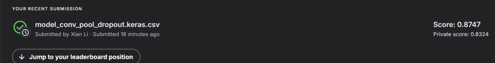

# Problem Description

The goal of this project is to create an algorithm to identify metastatic cancer in small image patches taken from larger digital pathology scans. The data for the project is a slightly modified version of the PatchCamelyon (PCam) benchmark dataset. For each picture, the model must predict if the center 32x32 region contains at least 1 pixel of tumor tissue. Refer to the jupyter notebook inside the `jupyter_notebook folder` for the graphs and etc. 

# Model Architecture

My model architecture will have an input layer that takes in the (96, 96, 3) inputs. To keep things simple so that raw inputs for the model won't need to be scaled, I added a scaling layer to divide the input by 255 and subtract 0.5. 

I tried a few different models. To start with, I created a model with 3 CNN layers with 32 filters each and a flatten layer at the end to feed into the dense output layer. I didn't add any padding since the main problem was to determine whether the center 32x32 pixels showed cancer cells. Relu activation functions were used for the CNN layers, and a sigmoid function was used for the output layer since this is a binary classification problem. Afterwards, the labels of 0/1 will be assigned by rounding the outputs. 

To build off the simple model, I then add to it by

- Add more filters (Detect more features)
- Add MaxPooling and Dropout (Reduce dimensionality with pooling and add some regularization with dropout)
- Add regularization to the CNN layers and reduce Dropout (Add a different form of regularization)

The idea behind the models is to add more complexity while adding ways to help with potential overfitting issues that may arise. 

To help with training, the Adam optimizer was used to adjust the learning rates during training. 

Due to training time, I first trained each model with 5 epochs with the base learning rate of 0.001. Afterwards, I doubled the epochs to 10 since I found that it would complete just before my Kaggle compute time limitations, as well as doubled the base learning rate. The CNN model with increasing filters was not able to finish 10 epochs within 12 hours, so to avoid the complication of training the model in multiple runs, it was discarded. 

# Results and Analysis

From the training results, I can see that there is overfitting happening. The blue lines showing the training accuracy and validation accuracy for the "simple" model, with 3 convolution layers with 32 filters each shows the training accuracy increasing constantly, while the validation accuracy starts dropping after the 2nd epoch. The same can be said to the 3 convolution layers model with increasing filters shown in red. This is expected, since if the smaller model is overfitting, the more complicated model will also overfit. 

The overly complex model with 3 convolution layers of increasing filters and L2 regularization, 3 maxpooling layers, and dropout seemed to have trouble learning the data as shown from the purple and orange lines. Even with the higher base learning rate, both performed similarly in how their training and validation accuracy behaved. Due to both having issues learning, the early stopping kept it at 5 epochs for both runs. 

The best performing model, which was the 3 convolution layers of increasing filters, 3 maxpooling layers, and dropout, showed a consistant increase in both training and validation accuracy, shown by the green and brown lines. Surprisingly, the validation accuracy was higher than the training accuracy, which may indicate that it was generalizing well. However, doubling the base learning rate seems to have hurt performance. The higher learning rate likely made it harder for the model to converge. 

# Conclusion

In conclusion, the best performing model was one with maxpooling and dropout to help with feature extraction and overfitting. The dataset was large, so it was very easy for models to overfit. This can be seen from the training accuracy for the simple models without any regularization or features to help with overfitting, as training accuracy continues improving but validation accuracy decreases or plateaus. Additionally, too much regularization did not help and caused the model to have trouble learning. 

If I spend more time on this project, I would try training the best performing model with more epochs and lower the aggressive early stopping since it kept all models from training more than 6 epochs. A lower learning rate is also beneficial as seen between the difference in performance between the same models with different learning rates. I would also try processing the input data a bit more and remove the brightness aspect, since all the images were just various shades of red, and the different brightnesses could be seen as noise. 

# Kaggle Result

